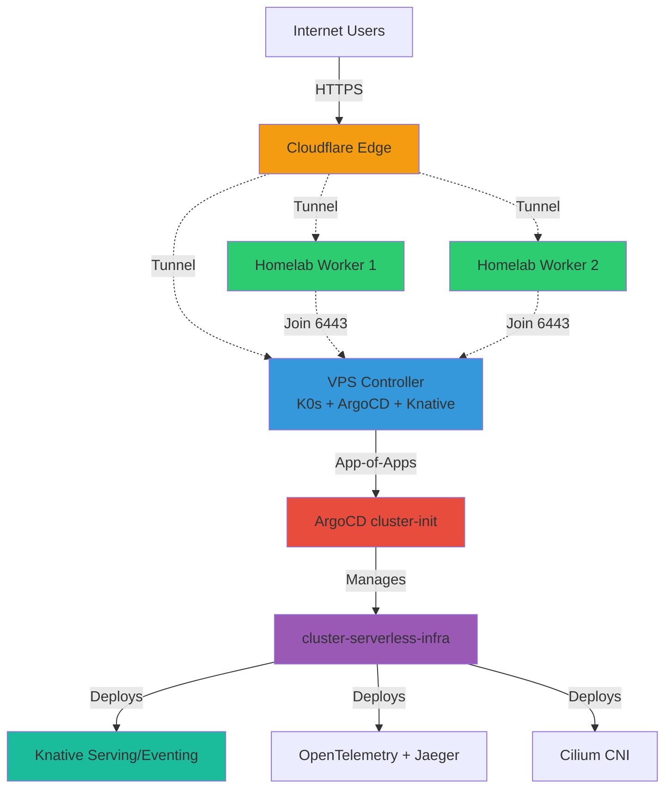

# k0s-cluster-bootstrap

GitOps-powered Kubernetes cluster bootstrap for **VPS/Homelab** deployments using [k0s](https://k0sproject.io/), [ArgoCD](https://argo-cd.readthedocs.io/), [Knative](https://knative.dev/), and [Sealed Secrets](https://github.com/bitnami-labs/sealed-secrets).

> 🏡 **Serverless Platform for VPS/Homelab with Full GitOps**
> 
> This setup provides:
> - **Knative Serving**: Serverless request-driven workloads (scale-to-zero)
> - **Knative Eventing**: Event-driven architecture
> - **App-of-Apps Pattern**: Self-healing infrastructure management
> - **Cloudflare Tunnel**: Secure access without exposed ports
> - **Observability Stack**: OpenTelemetry + Jaeger tracing
> - Works behind CGNAT, VPS, or hybrid deployments

## 💡 Why This Setup?

**Traditional Kubernetes challenges**:
- ❌ Requires static public IP
- ❌ Complex port forwarding setup
- ❌ Manual SSL certificate management
- ❌ Doesn't work behind CGNAT
- ❌ Heavy resource requirements
- ❌ Manual infrastructure management

**Our solution**:
- ✅ **Serverless Platform**: Knative for scale-to-zero workloads
- ✅ **App-of-Apps GitOps**: cluster-init manages all infrastructure
- ✅ **Self-Healing**: Delete any app, it auto-recreates via GitOps
- ✅ Works behind CGNAT with Cloudflare Tunnel
- ✅ No inbound ports needed
- ✅ Automatic SSL via Cloudflare
- ✅ Full observability with OpenTelemetry + Jaeger
- ✅ Lightweight k0s (50-70% less resources than full K8s)

## 📚 Prerequisites

### For Controller Node (VPS recommended)
- **OS**: Ubuntu 22.04 LTS / Debian 11+ / RHEL 8+
- **CPU**: 4 cores (vCPU)
- **RAM**: 8 GB
- **Storage**: 100 GB SSD
- **Network**: Public IP or stable connection
- **Kernel**: Linux 5.4+ (for eBPF support)

### For Worker Nodes (VPS or Homelab)
- **OS**: Ubuntu 22.04 LTS / Debian 11+ / RHEL 8+
- **CPU**: 4 cores
- **RAM**: 8 GB
- **Storage**: 50 GB SSD
- **Network**: Outbound internet access (works behind CGNAT!)

### External Requirements
- Domain managed in Cloudflare DNS (e.g., `benedict-aryo.com`)
- Git repository for GitOps (this repo)
- sudo privileges on all nodes

## 🏛️ Architecture



## 📊 Project Structure

```
k0s-cluster-bootstrap/
├── scripts/
│   ├── install-prerequisites.sh       # Install Helm, kubeseal
│   ├── install-k0s-controller.sh      # Install k0s controller (with taint removal)
│   ├── install-k0s-worker.sh          # Install k0s worker node
│   └── setup-argocd.sh                # Install Cilium, Knative Operator, Sealed Secrets, ArgoCD
├── manifests/
│   ├── argocd/
│   │   ├── namespace.yaml             # ArgoCD namespace
│   │   └── cluster-init.yaml          # App-of-Apps root application
│   └── applications/
│       └── cluster-serverless-app.yaml  # Managed by cluster-init
├── config/
│   └── k0s.yaml                       # K0s cluster configuration
└── README.md

cluster-serverless/ (separate repo)
└── infra/
    ├── values.yaml                    # Infrastructure configuration
    ├── Chart.yaml                     # Helm chart metadata
    └── templates/
        ├── cilium-app.yaml            # Cilium ArgoCD Application
        ├── sealed-secrets-app.yaml    # Sealed Secrets ArgoCD Application
        ├── knative-serving-cr.yaml    # KnativeServing CR (managed by Operator)
        ├── knative-eventing-cr.yaml   # KnativeEventing CR (managed by Operator)
        ├── observability-namespace.yaml
        ├── opentelemetry/
        │   └── deployment.yaml        # OpenTelemetry Collector
        ├── jaeger/
        │   ├── deployment.yaml        # Jaeger all-in-one
        │   └── service.yaml
        └── cloudflare-tunnel/
            ├── deployment.yaml
            ├── namespace.yaml
            └── secret.yaml            # SealedSecret (encrypted token)
```

## 🔄 GitOps Flow (App-of-Apps Pattern)

```
1. Bootstrap installs:
   - K0s controller
   - Cilium CNI
   - Knative Operator v1.17.1
   - Sealed Secrets controller
   - ArgoCD

2. ArgoCD deploys cluster-init (App-of-Apps):
   manifests/argocd/cluster-init.yaml
   
3. cluster-init manages:
   - cluster-serverless-infra (Helm chart from cluster-serverless repo)
   
4. cluster-serverless-infra deploys:
   - Cilium Application (via ArgoCD)
   - Sealed Secrets Application (via ArgoCD)
   - KnativeServing CR → Knative Operator deploys Serving components
   - KnativeEventing CR → Knative Operator deploys Eventing components
   - Cloudflare Tunnel (with SealedSecret)
   - OpenTelemetry Collector
   - Jaeger

5. Self-Healing:
   Delete any app → cluster-init recreates it within 30 seconds
```

## 🚀 Quick Start

### 📦 Installation Steps

#### Step 1: Install Prerequisites & K0s Controller

On the **controller node** (VPS recommended):

```bash
git clone https://github.com/BenedictusAryo/k0s-cluster-bootstrap.git
cd k0s-cluster-bootstrap/scripts

# Install prerequisites (Helm, kubeseal)
chmod +x *.sh
./install-prerequisites.sh

# Install K0s controller
./install-k0s-controller.sh
# Choose option 1 for single-node cluster (controller runs workloads)
```

The script will:
- Install k0s binary
- Configure controller using `config/k0s.yaml`
- Start k0s service
- Remove control-plane taint (allows pod scheduling)
- Generate kubeconfig at `~/.kube/config`

#### Step 2: Deploy ArgoCD + Infrastructure

This installs the complete stack via GitOps:

```bash
./setup-argocd.sh
```

This script will:
1. Install **Cilium CNI** (eBPF-based networking) with the **Gateway API controller** (needed for Cloudflare → Cilium routing)
2. Install **Knative Operator** v1.17.1 (manages Knative lifecycle)
3. Install **Sealed Secrets controller** (for encrypted secrets in Git)
4. Install **ArgoCD** (GitOps engine)
5. Deploy **cluster-init** App-of-Apps (manages all infrastructure)

cluster-init will then automatically deploy:
- cluster-serverless-infra (Helm chart)
  - Cilium Application
  - Sealed Secrets Application  
  - KnativeServing CR → Operator deploys Serving + Kourier
  - KnativeEventing CR → Operator deploys Eventing
  - OpenTelemetry Collector
  - Jaeger tracing UI
  - Cloudflare Tunnel (after SealedSecret is configured)

#### Step 3: Configure Cloudflare Tunnel

**A. Generate Sealed Secret for Tunnel Token**

Follow the guide in cluster-serverless repository:
```bash
cd ../cluster-serverless
# See: docs/CLOUDFLARE_TUNNEL_GITOPS_SETUP.md for complete setup
# Or use the quick script:
cd scripts
./generate-sealed-secret.sh
```

This will prompt for your Cloudflare Tunnel token and create an encrypted secret in Git.

**B. Configure Single Wildcard Route (ONE-TIME SETUP)**

In Cloudflare Zero Trust Dashboard, create just **ONE route**:

1. Go to: https://one.dash.cloudflare.com/
2. Navigate: **Networks** → **Tunnels** → Your tunnel
3. Go to **"Public Hostname"** tab  
4. Click **"Add a public hostname"**
5. Fill in:
   - **Subdomain**: `*` (wildcard - routes ALL subdomains)
   - **Domain**: `benedict-aryo.com` (your domain)
   - **Type**: `HTTPS`
   - **URL**: `https://cloudflare-gateway.gateway-system.svc.cluster.local:443`
   - **TLS Options**: ✅ Enable "No TLS Verify" (Gateway presents an internal cert)
6. Click **"Save"**

**That's it!** This single wildcard route sends ALL `*.benedict-aryo.com` traffic to the Cilium `cloudflare-gateway`. From there, Gateway HTTPRoutes decide whether to send the request directly to an infrastructure Service or hand it to Kourier for Knative workloads.

**C. All Application Routing Managed in Git**

After the wildcard route is configured, **never touch the Cloudflare dashboard again** for routing! (Verify the controller with `kubectl -n kube-system get deploy cilium-gateway-controller` — it should be installed automatically now.)

All application routing is managed via Kubernetes manifests in Git:

**For infrastructure services** (ArgoCD, Jaeger, etc.):
```yaml
# Example: ArgoCD Gateway HTTPRoute
apiVersion: gateway.networking.k8s.io/v1
kind: HTTPRoute
metadata:
   name: argocd-route
   namespace: argocd
spec:
   parentRefs:
   - name: cloudflare-gateway
      namespace: gateway-system
   hostnames:
   - argocd.benedict-aryo.com
   rules:
   - backendRefs:
      - name: argocd-server
         namespace: argocd
         port: 443
```

**For serverless applications**:
```yaml
# Knative Service - automatically creates route
apiVersion: serving.knative.dev/v1
kind: Service
metadata:
  name: my-app
  namespace: default
spec:
  template:
    spec:
      containers:
      - image: gcr.io/knative-samples/helloworld-go
```
Automatically accessible at: `my-app.default.benedict-aryo.com`

**How it works**:
1. User accesses `argocd.benedict-aryo.com`
2. Cloudflare routes to the `cloudflare-gateway` (via wildcard route)
3. Gateway matches the HTTPRoute and forwards directly to `argocd-server`
4. For Knative hostnames, the wildcard HTTPRoute forwards to `kourier-gateway`, which performs revision-level routing
5. **All routing logic in Git!** 🎉

#### Step 4: Verify Deployment

```bash
# Check ArgoCD applications
kubectl get app -n argocd

# Expected output:
# NAME                       SYNC STATUS   HEALTH STATUS
# cilium                     Synced        Healthy
# cluster-init               Synced        Healthy
# cluster-serverless-infra   Synced        Healthy
# sealed-secrets             Synced        Healthy

# Check all infrastructure pods
kubectl get pods -A

# Access ArgoCD UI
kubectl -n argocd get secret argocd-initial-admin-secret -o jsonpath="{.data.password}" | base64 -d
# Username: admin
# Password: (from above command)

# Port forward to access locally
kubectl port-forward svc/argocd-server -n argocd 8080:443
# Visit: https://localhost:8080
```

#### Step 5: Add Worker Nodes (Optional)

On the controller, generate a join token:

```bash
sudo k0s token create --role=worker
```

On each worker node:

```bash
git clone https://github.com/BenedictusAryo/k0s-cluster-bootstrap.git
cd k0s-cluster-bootstrap/scripts
chmod +x *.sh
./install-prerequisites.sh
./install-k0s-worker.sh <JOIN-TOKEN-FROM-CONTROLLER>
```

### Step 3: Set up ArgoCD

On the controller node (or any machine with kubectl access):

```bash
cd scripts
./setup-argocd.sh
```

This will:
- Create the ArgoCD namespace
- Deploy ArgoCD
- Deploy the cluster bootstrap application
- Display the admin password

### Step 4: Access ArgoCD UI

Forward the ArgoCD server port:

```bash
kubectl port-forward svc/argocd-server -n argocd 8080:443
```

Access the UI at `https://localhost:8080`

- Username: `admin`
- Password: (displayed after running setup-argocd.sh)

## 🔐 Secret Management

This repository uses Sealed Secrets to securely store secrets in Git.

### Installing kubeseal CLI

```bash
# Linux
wget https://github.com/bitnami-labs/sealed-secrets/releases/download/v0.24.0/kubeseal-0.24.0-linux-amd64.tar.gz
tar xfz kubeseal-0.24.0-linux-amd64.tar.gz
sudo install -m 755 kubeseal /usr/local/bin/kubeseal

# macOS
brew install kubeseal
```

### Creating Sealed Secrets

1. Create your secret file (use the example as a template):

```bash
cp secrets/examples/cloudflare-secret.example secrets/my-secret.yaml
# Edit the file with your actual values
```

2. Seal the secret:

```bash
kubeseal --format=yaml < secrets/my-secret.yaml > secrets/my-sealed-secret.yaml
```

3. Apply the sealed secret:

```bash
kubectl apply -f secrets/my-sealed-secret.yaml
```

4. Commit only the sealed secret to Git (never commit the unsealed version)

### Setting up Cloudflare Tunnel (Required for App Access)

Cloudflare Tunnel provides secure access to your applications without exposing ports to the internet.

#### Step 1: Create Cloudflare Tunnel

1. Log in to [Cloudflare Zero Trust Dashboard](https://one.dash.cloudflare.com/)
2. Navigate to **Networks** → **Tunnels**
3. Click **Create a tunnel**
4. Choose **Cloudflared** as the connector type
5. Name your tunnel (e.g., `k0s-cluster-tunnel`)
6. Copy the tunnel token (starts with `eyJh...`)

#### Step 2: Create Kubernetes Secret

**IMPORTANT**: Deploy the tunnel **inside Kubernetes**, not as a system service. This ensures it works across all deployment scenarios (VPS, Hybrid, Homelab).

```bash
# Create the cloudflare-tunnel namespace
kubectl create namespace cloudflare-tunnel

# Create and seal the secret in one step (no plain secret stored!)
kubectl create secret generic cloudflare-tunnel-secret \
  --from-literal=tunnel-token="eyJhIjoiMDJkYjBlMDJjODNiMjg0MGIyZWM3NGM4MjAxNWQ1YW..." \
  -n cloudflare-tunnel \
  --dry-run=client -o yaml | \
  kubeseal --controller-name=sealed-secrets --controller-namespace=kube-system \
  -o yaml > manifests/sealed-secrets/secrets/cloudflare-tunnel-sealed.yaml

# Apply the sealed secret
kubectl apply -f manifests/sealed-secrets/secrets/cloudflare-tunnel-sealed.yaml

# Verify the secret was created
kubectl get secret cloudflare-tunnel-secret -n cloudflare-tunnel
```

**Note**: Sealed secrets are **safe to commit to Git**! They're encrypted and can only be decrypted by your cluster's Sealed Secrets Controller.

#### Step 3: Find Service Names for Routing

Before configuring Cloudflare routes, you need to find the internal Kubernetes service names:

```bash
# List all services to find service names
kubectl get svc -A

# Get specific service details
kubectl get svc -n argocd
kubectl get svc -n kourier-system
kubectl get svc -n observability
```

**Understanding Kubernetes DNS format:**
```
<service-name>.<namespace>.svc.cluster.local:<port>

Examples:
- argocd-server.argocd.svc.cluster.local:443
- kourier.kourier-system.svc.cluster.local:80
- jaeger-query.observability.svc.cluster.local:16686
```

**Key services in this setup:**
- **ArgoCD**: Service `argocd-server` in namespace `argocd`, port `443`
- **Kourier**: Service `kourier` in namespace `kourier-system`, port `80`
- **Jaeger**: Service `jaeger-query` in namespace `observability`, port `16686`

#### Step 4: Configure Public Hostnames

In the Cloudflare Zero Trust Dashboard, configure your tunnel routes:

1. **ArgoCD** (for GitOps management):
   - Subdomain: `argocd`
   - Domain: `your-domain.com`
   - Service Type: `HTTPS`
   - URL: `argocd-server.argocd.svc.cluster.local:443`
   - Additional settings → TLS → Enable **"No TLS Verify"** ✅
   
   **Why "No TLS Verify"?** ArgoCD uses self-signed certificates internally. This setting tells Cloudflare Tunnel to trust the internal certificate. Your traffic is still encrypted end-to-end.

2. **Jaeger** (optional, for observability):
   - Subdomain: `jaeger`
   - Domain: `your-domain.com`
   - Service Type: `HTTP`
   - URL: `jaeger-query.observability.svc.cluster.local:16686`

3. **Knative Services** (wildcard for all apps):
   - Subdomain: `*` (wildcard)
   - Domain: `your-domain.com`
   - Service Type: `HTTP`
   - URL: `kourier.kourier-system.svc.cluster.local:80`

4. **Catch-all rule**: `http_status:404`

**Important Notes**:
- ⚠️ **Route Order Matters**: Place specific routes (argocd, jaeger) BEFORE the wildcard route
- ✅ The wildcard route handles all Knative services (e.g., `hello.your-domain.com`, `api.your-domain.com`)
- ✅ These URLs use Kubernetes internal DNS - they only work from inside the cluster (where the tunnel pod runs)

#### Step 5: Create DNS Records

In the Cloudflare DNS dashboard (not Zero Trust):

1. Add CNAME record for ArgoCD:
   - **Type**: `CNAME`
   - **Name**: `argocd`
   - **Target**: `<your-tunnel-id>.cfargotunnel.com` (find this in your tunnel settings)
   - **Proxy status**: ✅ Proxied (orange cloud)

2. Add CNAME record for Jaeger (optional):
   - **Name**: `jaeger`
   - **Target**: `<your-tunnel-id>.cfargotunnel.com`
   - **Proxy status**: ✅ Proxied

3. Add wildcard CNAME for Knative services:
   - **Name**: `*`
   - **Target**: `<your-tunnel-id>.cfargotunnel.com`
   - **Proxy status**: ✅ Proxied

#### Step 6: Enable Cloudflare Tunnel in Helm Chart

After creating the sealed secret, enable the tunnel in your cluster-serverless infrastructure:

```bash
# Edit infra/values.yaml in cluster-serverless repo
cloudflareTunnel:
  enabled: true  # Change from false to true
```

Commit and push the change. ArgoCD will automatically deploy the tunnel pods.

#### Step 7: Verify Tunnel Deployment

```bash
# Check tunnel pods are running
kubectl get pods -n cloudflare-tunnel

# Check tunnel logs
kubectl logs -n cloudflare-tunnel -l app.kubernetes.io/name=cloudflare-tunnel

# Test access from your browser
# Visit: https://argocd.your-domain.com
```

**Expected result**: You should see the ArgoCD login page! 🎉

#### Why Deploy Tunnel in Kubernetes vs System Service?

**✅ Kubernetes Deployment (Recommended)**:
- Works across all scenarios (VPS, Hybrid, Homelab)
- Uses cluster DNS (e.g., `argocd-server.argocd.svc.cluster.local`)
- High availability (multiple replicas)
- Survives node restarts
- GitOps managed

**❌ System Service (Not Recommended)**:
- Only works on single node
- Can't use cluster DNS names
- Requires NodePort or port-forwarding
- Manual configuration on each node
- Not GitOps managed

## 📖 Configuration

### K0s Configuration

Edit `config/k0s.yaml` to customize your k0s cluster:
- Network settings (podCIDR, serviceCIDR)
- API server configuration
- Storage backend
- Extensions and Helm charts

### ArgoCD Configuration

The `manifests/argocd/cluster-bootstrap-app.yaml` defines the GitOps application that manages your cluster. Customize:
- Repository URL
- Target revision (branch/tag)
- Sync policy

## 🔧 Common Tasks

### View Cluster Status

```bash
sudo k0s status
kubectl get nodes
```

### Get Worker Join Token

```bash
sudo k0s token create --role=worker
```

### Reset k0s Installation

```bash
sudo k0s stop
sudo k0s reset
```

### Update ArgoCD Applications

ArgoCD automatically syncs from Git. To manually sync:

```bash
argocd app sync cluster-bootstrap
```

## 🛠️ Troubleshooting

### k0s controller won't start

- Check logs: `sudo journalctl -u k0scontroller -f`
- Verify port 6443 is available
- Ensure sufficient resources

### ArgoCD can't access repository

- Verify repository URL in `cluster-bootstrap-app.yaml`
- Check if repository is public or configure credentials
- Review ArgoCD logs: `kubectl logs -n argocd -l app.kubernetes.io/name=argocd-server`

### Sealed Secrets controller not working

- Verify controller is running: `kubectl get pods -n sealed-secrets`
- Check controller logs: `kubectl logs -n sealed-secrets -l app.kubernetes.io/name=sealed-secrets-controller`

## 📚 Additional Resources

- [k0s Documentation](https://docs.k0sproject.io/)
- [ArgoCD Documentation](https://argo-cd.readthedocs.io/)
- [Sealed Secrets Documentation](https://github.com/bitnami-labs/sealed-secrets)

## 🤝 Contributing

Contributions are welcome! Please feel free to submit a Pull Request.

## 📝 License

This project is licensed under the terms specified in the LICENSE file.

## ⚠️ Security Notes

- Never commit unsealed secrets to Git
- Regularly rotate your sealed secrets encryption keys
- Use RBAC to control access to sealed secrets
- Keep your k0s and ArgoCD versions up to date