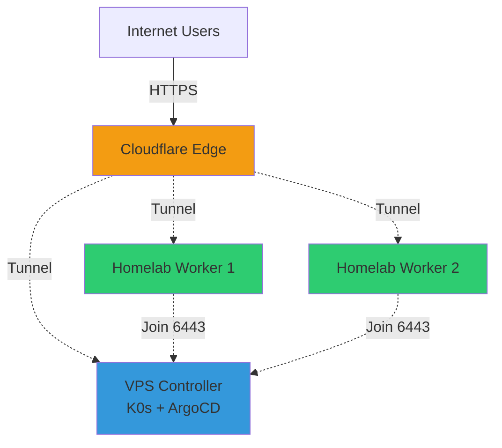

# k0s-cluster-bootstrap

GitOps-powered Kubernetes cluster bootstrap for **VPS/Homelab** deployments using [k0s](https://k0sproject.io/), [ArgoCD](https://argo-cd.readthedocs.io/), and [Sealed Secrets](https://github.com/bitnami-labs/sealed-secrets).

> 🏡 **Perfect for homelab behind CGNAT or VPS deployments**
> 
> This setup works great with:
> - VPS hosting (DigitalOcean, Hetzner, Linode, etc.)
> - Homelab servers behind CGNAT (no port forwarding needed!)
> - Hybrid setups (VPS controller + homelab workers)
> - Single-node or multi-node clusters

## 💡 Why This Setup?

**Traditional Kubernetes challenges**:
- ❌ Requires static public IP
- ❌ Complex port forwarding setup
- ❌ Manual SSL certificate management
- ❌ Doesn't work behind CGNAT
- ❌ Heavy resource requirements

**Our solution**:
- ✅ Works behind CGNAT with Cloudflare Tunnel
- ✅ No inbound ports needed
- ✅ Automatic SSL via Cloudflare
- ✅ GitOps-based deployment
- ✅ Lightweight k0s (50-70% less resources than full K8s)
- ✅ Add worker nodes from anywhere

## 📚 Prerequisites

### For Controller Node (VPS recommended)
- **OS**: Ubuntu 22.04 LTS / Debian 11+ / RHEL 8+
- **CPU**: 4 cores (vCPU)
- **RAM**: 8 GB
- **Storage**: 100 GB SSD
- **Network**: Public IP or stable connection
- **Kernel**: Linux 5.4+ (for eBPF support)

### For Worker Nodes (VPS or Homelab)
- **OS**: Ubuntu 22.04 LTS / Debian 11+ / RHEL 8+
- **CPU**: 4 cores
- **RAM**: 8 GB
- **Storage**: 50 GB SSD
- **Network**: Outbound internet access (works behind CGNAT!)

### External Requirements
- Domain managed in Cloudflare DNS (e.g., `benedict-aryo.com`)
- Git repository for GitOps (this repo)
- sudo privileges on all nodes

## 🏛️ Architecture



## 📊 Project Structure

```
cluster-bootstrap/
├── scripts/
│   ├── install-k0s-controller.sh  # Install k0s controller node
│   ├── install-k0s-worker.sh      # Install k0s worker node
│   └── setup-argocd.sh            # Deploy ArgoCD
├── manifests/
│   ├── argocd/
│   │   ├── namespace.yaml                # ArgoCD namespace
│   │   ├── argocd-install.yaml          # ArgoCD configuration
│   │   └── cluster-bootstrap-app.yaml   # Bootstrap application
│   └── sealed-secrets/
│       └── controller.yaml              # Sealed Secrets controller
├── config/
│   └── k0s.yaml                         # K0s cluster configuration
├── secrets/
│   └── examples/
│       └── cloudflare-secret.example    # Example secret template
└── README.md
```

## 🚀 Quick Start

### 🎯 Deployment Scenarios

Choose your deployment scenario:

#### Scenario 1: VPS-Only (Simplest)
Perfect for getting started quickly with a single VPS or multiple VPS nodes.

#### Scenario 2: Hybrid VPS + Homelab (Recommended)
VPS controller for stability + homelab workers for cost savings. Works great behind CGNAT!

#### Scenario 3: Pure Homelab
All nodes in homelab (requires one node with stable connection for controller).

---

### 📦 Installation Steps

#### Step 1: Install Prerequisites (All Nodes)

On **every** node (controller and workers):

```bash
git clone https://github.com/BenedictusAryo/k0s-cluster-bootstrap.git
cd k0s-cluster-bootstrap/scripts
chmod +x *.sh
./install-prerequisites.sh
./install-k0s-controller.sh
```

This will:
- Download and install k0s
- Configure the controller using `config/k0s.yaml`
- Start the k0s service
- Generate kubeconfig file

### Step 2: Add Worker Nodes (Optional)

First, generate a join token on the controller:

```bash
sudo k0s token create --role=worker
```

Then, on each worker node:

```bash
cd scripts
./install-k0s-worker.sh <join-token>
```

### Step 3: Set up ArgoCD

On the controller node (or any machine with kubectl access):

```bash
cd scripts
./setup-argocd.sh
```

This will:
- Create the ArgoCD namespace
- Deploy ArgoCD
- Deploy the cluster bootstrap application
- Display the admin password

### Step 4: Access ArgoCD UI

Forward the ArgoCD server port:

```bash
kubectl port-forward svc/argocd-server -n argocd 8080:443
```

Access the UI at `https://localhost:8080`

- Username: `admin`
- Password: (displayed after running setup-argocd.sh)

## 🔐 Secret Management

This repository uses Sealed Secrets to securely store secrets in Git.

### Installing kubeseal CLI

```bash
# Linux
wget https://github.com/bitnami-labs/sealed-secrets/releases/download/v0.24.0/kubeseal-0.24.0-linux-amd64.tar.gz
tar xfz kubeseal-0.24.0-linux-amd64.tar.gz
sudo install -m 755 kubeseal /usr/local/bin/kubeseal

# macOS
brew install kubeseal
```

### Creating Sealed Secrets

1. Create your secret file (use the example as a template):

```bash
cp secrets/examples/cloudflare-secret.example secrets/my-secret.yaml
# Edit the file with your actual values
```

2. Seal the secret:

```bash
kubeseal --format=yaml < secrets/my-secret.yaml > secrets/my-sealed-secret.yaml
```

3. Apply the sealed secret:

```bash
kubectl apply -f secrets/my-sealed-secret.yaml
```

4. Commit only the sealed secret to Git (never commit the unsealed version)

## 📖 Configuration

### K0s Configuration

Edit `config/k0s.yaml` to customize your k0s cluster:
- Network settings (podCIDR, serviceCIDR)
- API server configuration
- Storage backend
- Extensions and Helm charts

### ArgoCD Configuration

The `manifests/argocd/cluster-bootstrap-app.yaml` defines the GitOps application that manages your cluster. Customize:
- Repository URL
- Target revision (branch/tag)
- Sync policy

## 🔧 Common Tasks

### View Cluster Status

```bash
sudo k0s status
kubectl get nodes
```

### Get Worker Join Token

```bash
sudo k0s token create --role=worker
```

### Reset k0s Installation

```bash
sudo k0s stop
sudo k0s reset
```

### Update ArgoCD Applications

ArgoCD automatically syncs from Git. To manually sync:

```bash
argocd app sync cluster-bootstrap
```

## 🛠️ Troubleshooting

### k0s controller won't start

- Check logs: `sudo journalctl -u k0scontroller -f`
- Verify port 6443 is available
- Ensure sufficient resources

### ArgoCD can't access repository

- Verify repository URL in `cluster-bootstrap-app.yaml`
- Check if repository is public or configure credentials
- Review ArgoCD logs: `kubectl logs -n argocd -l app.kubernetes.io/name=argocd-server`

### Sealed Secrets controller not working

- Verify controller is running: `kubectl get pods -n sealed-secrets`
- Check controller logs: `kubectl logs -n sealed-secrets -l app.kubernetes.io/name=sealed-secrets-controller`

## 📚 Additional Resources

- [k0s Documentation](https://docs.k0sproject.io/)
- [ArgoCD Documentation](https://argo-cd.readthedocs.io/)
- [Sealed Secrets Documentation](https://github.com/bitnami-labs/sealed-secrets)

## 🤝 Contributing

Contributions are welcome! Please feel free to submit a Pull Request.

## 📝 License

This project is licensed under the terms specified in the LICENSE file.

## ⚠️ Security Notes

- Never commit unsealed secrets to Git
- Regularly rotate your sealed secrets encryption keys
- Use RBAC to control access to sealed secrets
- Keep your k0s and ArgoCD versions up to date